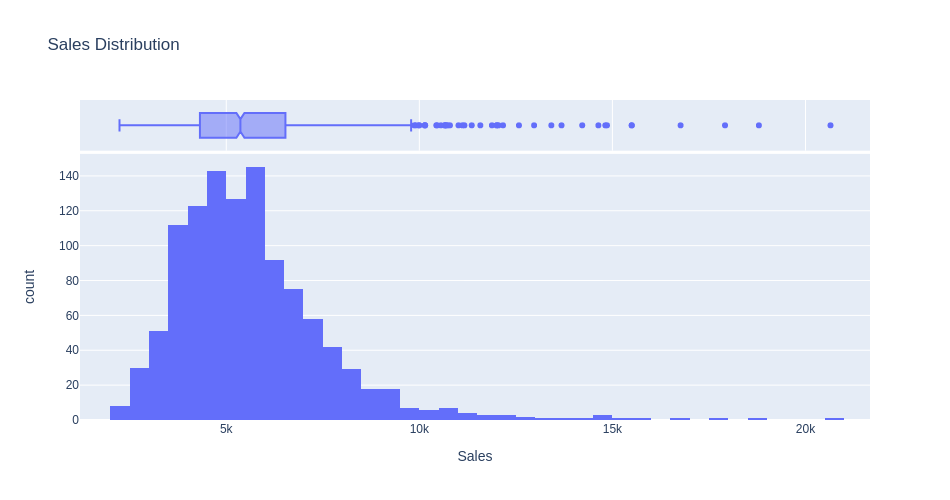
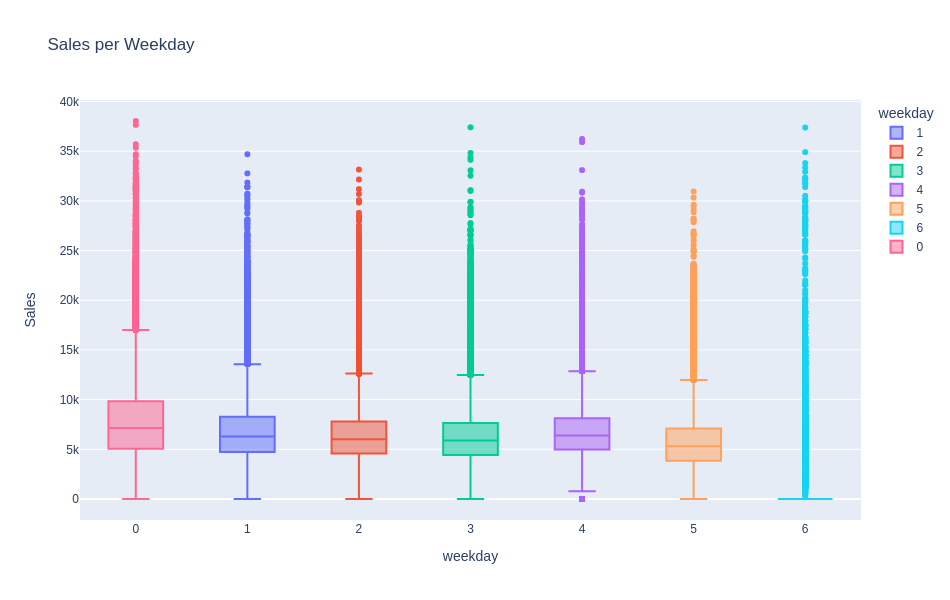
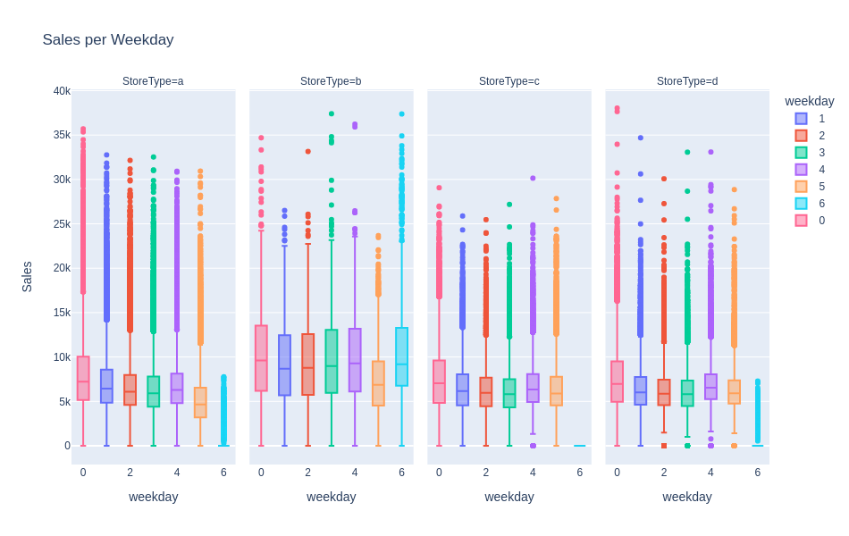
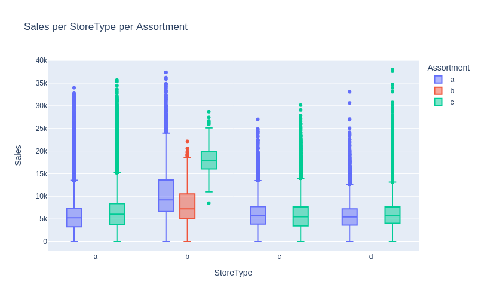
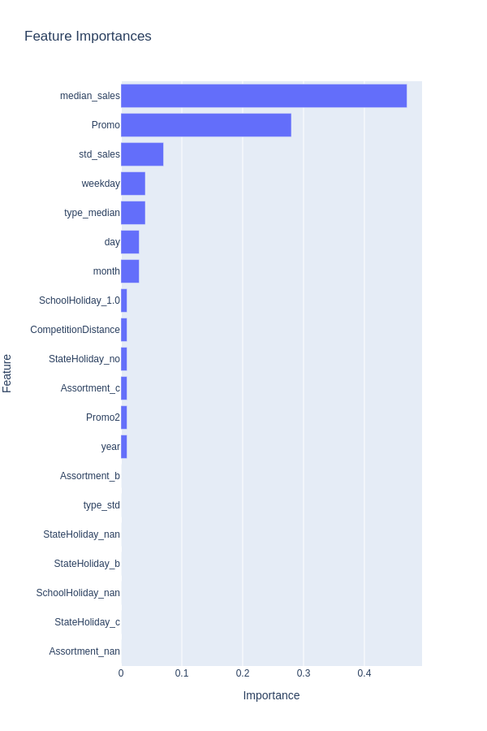
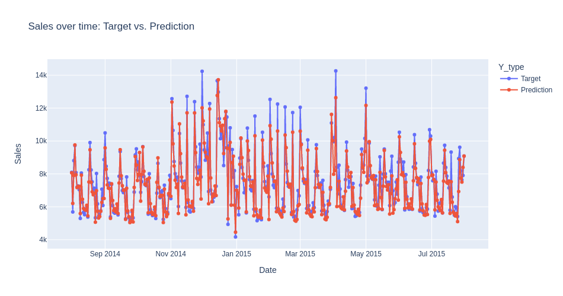
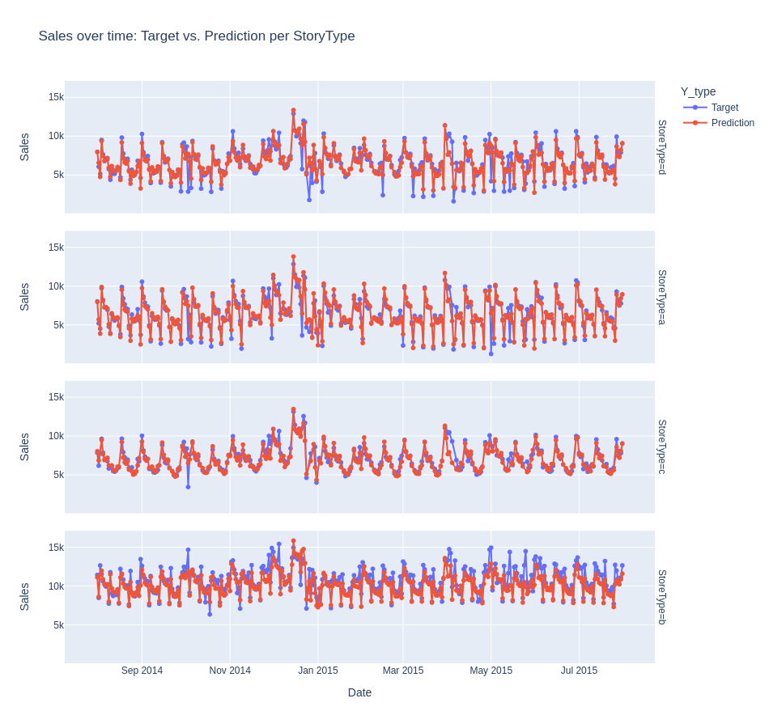
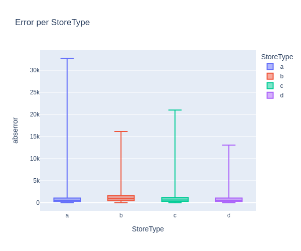
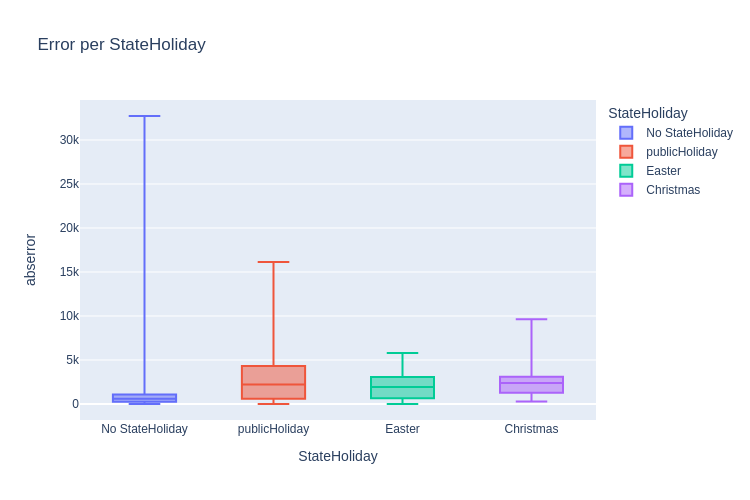
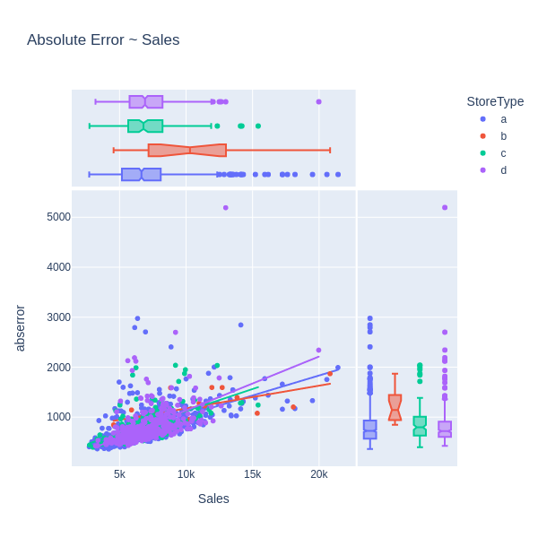

# Rossman Sales Forecast

We estimate a forecast for Rossman sales data based on historical sales data.

Before the first run, please make sure you extract the required data by running:

```
python data.py
python data.py --test 1
```

For details of the model and to run it please see 'presentation.ipynb'. Analyis
charts are provided in 'analysis.ipynb'.

You can also execute the model by running:

```
python main.py
```

The model is tested on Python 3.8 and the libraries listed in requirements.txt.

If running it on test data, please edit 'presentation.ipynb' or main.py to
include the path of the test data.


# File structure of the model

The model is composed of the following files:
<ol>
<li> a main file containing the data input, and the fitting and prediction of the model. The data loading is described in the 'Data input' section.</li>

<li> a data cleaning file where a data cleaning class is defined. The effect of the data cleaning class is described in 'Data cleaning section'</li>

<li> a model file containing the actual model and its parameters. The content of the model is descrived in the 'Model' section.</li>
</ol>


```python
import pandas as pd

from models import define_pipelines
from models import single_run
```

# Data input
<ol>
<li> The data are loaded.</li>

<li> We split the sales from the data. We obtain three DataFrames:
    <ol>
    <li> Training data for the store: 'Date', 'Store', 'DayOfWeek', 'Sales', 'Customers', 'Open', 'Promo', 'StateHoliday', 'SchoolHoliday'</li>
    <li> Store data: 'Store', 'StoreType', 'Assortment', 'CompetitionDistance',
       'CompetitionOpenSinceMonth', 'CompetitionOpenSinceYear', 'Promo2', 'Promo2SinceWeek', 'Promo2SinceYear', 'PromoInterval'</li>
    <li> The target data: a Dataframe of one columns: 'Sale'</li>
    </ol>
</li>
</ol>


```python
TRAINING_DATA = 'data/train.csv'
HOLDOUT_DATA = 'data/holdout.csv'
STORE_DATA = 'data/store.csv'
TEST_DATA = '' # input the path of the test data file here

RANDOM_SEED = 42
CORES = -1

try:
    df_test = pd.read_csv(TEST_DATA)
except FileNotFoundError:
    print('Test data file not found, using holdout as validation set')
    df_test = pd.read_csv(HOLDOUT_DATA)
    df_train = pd.read_csv(TRAINING_DATA)
else:
    print('Test data loaded, using full training data for model training')
    df_train = pd.concat([
        pd.read_csv(TRAINING_DATA),
        pd.read_csv(HOLDOUT_DATA)
    ])
finally:
    df_store = pd.read_csv(STORE_DATA)

X_train = df_train.drop(columns='Sales')
y_train = df_train.loc[:, 'Sales']
X_val = df_test.drop(columns='Sales')
y_val = df_test.loc[:, 'Sales']
```

    Test data file not found, using holdout as validation set


    /home/daniel/anaconda3/envs/rossmann-sales/lib/python3.8/site-packages/IPython/core/interactiveshell.py:3172: DtypeWarning: Columns (7) have mixed types.Specify dtype option on import or set low_memory=False.
      has_raised = await self.run_ast_nodes(code_ast.body, cell_name,


# Data cleaning

<ol>
<li> We merge an inner merge on the store columns, between the training data and the store data. </li>


<li> Rows with empty sales or store id are dropped. </li>

<li> We drop the rows for which the sales are zeros. </li>

<li> At inspection of the data, we observe that the 'StateHoliday' has a class defined by two distinct parameters: an integer 0 and a string 0. This is corrected. </li>

<li> For the date: we add three new columns containing week day, day, month and year. The columns 'DayofWeek' is redun dant, and dropped. The 'Date' columns is ultimately dropped. </li>

<li> We perform one hot encoding on the following parameters:
     'StateHoliday', 'Assortment', 'SchoolHoliday'
   For those columns containing Nan, a nan type columns is created. </li>


<li>  We introduce the follwing features
    <ol>
    <li> for each row, the median store sale of the corresponding store id of the row is added. </li>
    <li> for each row, the median store standard deviation of the corresponding store id of the row is added. </li>
    <li> for each row, the  store type mean sale of the store type of the corresponding row is added. </li>
    <li> for each row, the store stype standard deviation type of the store type of the corresponding row is added. </li>
     <li>   Ultimately, 'Store' id and 'Storetype' columns are dropped. </li>
     </ol>


<li> The 'CompetitionDistance' column has missing value, and is filled in median. </li>

<li> The 'Promotion' column has missing value, and is filled with the mininum of the remaining value.</li>

<li> Ultimately, the following columns are dropped:
'Store', 'CompetitionOpenSinceMonth', 'CompetitionOpenSinceYear','Promo2SinceWeek', 'Promo2SinceYear', 'PromoInterval', 'Date', 'Open',
'StoreType'. </li>

<li> The output of the cleaning is two dataframes with identical indices. The feature daraframe has the following columns:

'Promo', 'Sales', 'CompetitionDistance', 'Promo2', 'day', 'month',
       'year', 'weekday', 'median_sales', 'std_sales', 'type_median',
       'type_std', 'mean_sales', 'StateHoliday_b', 'StateHoliday_c',
       'StateHoliday_no', 'StateHoliday_nan', 'Assortment_b', 'Assortment_c',
       'Assortment_nan', 'SchoolHoliday_1.0', 'SchoolHoliday_nan'</li>


</ol>


```python
from data_cleaning import DataCleaning

cleaning_settings = dict(
    hot_encoded_columns=[
        'StateHoliday',
        'Assortment',
        'SchoolHoliday',
    ],
    dropped_columns=[
        'Store',
        'CompetitionOpenSinceMonth',
        'CompetitionOpenSinceYear',
        'Promo2SinceWeek',
        'Promo2SinceYear',
        'PromoInterval',
        'Date',
        'Open',
        'StoreType',
    ],
    filled_in_median=[
        'CompetitionDistance',
    ],
    filled_in_mode=[
        'Promo',
    ],
    target=[
        'Sales',
    ],
)

cleaning = DataCleaning(
    store=df_store,
    hot_encoded_columns=cleaning_settings['hot_encoded_columns'],
    dropped_columns=cleaning_settings['dropped_columns'],
    filled_in_median=cleaning_settings['filled_in_median'],
    filled_in_mode=cleaning_settings['filled_in_mode'],
    target=cleaning_settings['target'],
)

X_train_clean, y_train_clean =\
    cleaning.cleaning(X_train, y_train, training=True)
X_val_clean, y_val_clean =\
    cleaning.cleaning(X_val, y_val, training=False)
```

    Cyclicality removed. Added columns: log median, std, encoding for the store, somethin, and added standard deviation, best score for the boost
    cleaning on training done succesfully
    cleaning on test done succesfully


# Model Definition

<li> We opt for a boosted trees model (XGBRegressor) as this model showed to be less
prone to over-fitting compared to our alternative (a random forest). </li>
<li> After iterating over the feature selection and transformation we settle on the following features:


```python
X_train_clean.columns
```


    Index(['Promo', 'CompetitionDistance', 'Promo2', 'day', 'month', 'year',
           'weekday', 'median_sales', 'std_sales', 'type_median', 'type_std',
           'StateHoliday_b', 'StateHoliday_c', 'StateHoliday_no',
           'StateHoliday_nan', 'Assortment_b', 'Assortment_c', 'Assortment_nan',
           'SchoolHoliday_1.0', 'SchoolHoliday_nan'],
          dtype='object')


<li> A basic grid-search over some key hyper-parameters showed that 500 shallow trees with 3 levels and a learning rate of 0.2 performed best.


```python
xg_settings = dict(
    n_estimators=500,
    max_depth=3,
    learning_rate=0.2,
    random_state=RANDOM_SEED,
    n_jobs=CORES,
)
```

We define our pipeline (which consists of just the model itself), as scaling
showed no positive effect in our iterations:


```python
pipes = define_pipelines(xg_settings)
```

We then run the model, which returns a self-evaluation:


```python
__i = single_run(pipes, X_train_clean, y_train_clean,
           X_val_clean, y_val_clean, X_train, X_val)
```

    FittingPipeline(steps=[('model',
                     XGBRegressor(base_score=None, booster=None,
                                  colsample_bylevel=None, colsample_bynode=None,
                                  colsample_bytree=None, enable_categorical=False,
                                  gamma=None, gpu_id=None, importance_type=None,
                                  interaction_constraints=None, learning_rate=0.2,
                                  max_delta_step=None, max_depth=3,
                                  min_child_weight=None, missing=nan,
                                  monotone_constraints=None, n_estimators=500,
                                  n_jobs=-1, num_parallel_tree=None, predictor=None,
                                  random_state=42, reg_alpha=None, reg_lambda=None,
                                  scale_pos_weight=None, subsample=None,
                                  tree_method=None, validate_parameters=None,
                                  verbosity=None))])...
    ...done.

    Training performance:
    Mean as Baseline (RMSPE) 61.66152750493536

    model <class 'xgboost.sklearn.XGBRegressor'>
    feat_importance [('year', 0.01), ('weekday', 0.04), ('type_std', 0.0), ('type_median', 0.04), ('std_sales', 0.07), ('month', 0.03), ('median_sales', 0.47), ('day', 0.03), ('StateHoliday_no', 0.01), ('StateHoliday_nan', 0.0), ('StateHoliday_c', 0.0), ('StateHoliday_b', 0.0), ('SchoolHoliday_nan', 0.0), ('SchoolHoliday_1.0', 0.01), ('Promo2', 0.01), ('Promo', 0.28), ('CompetitionDistance', 0.01), ('Assortment_nan', 0.0), ('Assortment_c', 0.01), ('Assortment_b', 0.0)]
    rmspe 21.05
    prediction [4741.573  4467.9663 5004.8315 ... 8796.024  7589.8477 8719.509 ]

    Validation performance:
    Mean as Baseline (RMSPE) 62.24180029835583

    model <class 'xgboost.sklearn.XGBRegressor'>
    rmspe 21.41

# Analysis of the model


```python
import pandas as pd
import numpy as np

from models import define_pipelines
from models import single_run

import plotly.express as px

from IPython.display import Image
```

## Setting folders and initial parameters


```python
TRAINING_DATA = 'data/train.csv'
HOLDOUT_DATA = 'data/holdout.csv'
STORE_DATA = 'data/store.csv'
TEST_DATA = '' # input the path of the test data file here

RANDOM_SEED = 42
CORES = -1

try:
    df_test = pd.read_csv(TEST_DATA)
except FileNotFoundError:
    print('Test data file not found, using holdout as validation set')
    df_test = pd.read_csv(HOLDOUT_DATA)
    df_train = pd.read_csv(TRAINING_DATA)
else:
    print('Test data loaded, using full training data for model training')
    df_train = pd.concat([
        pd.read_csv(TRAINING_DATA),
        pd.read_csv(HOLDOUT_DATA)
    ])
finally:
    df_store = pd.read_csv(STORE_DATA)
```

    Test data file not found, using holdout as validation set


    /home/daniel/anaconda3/envs/rossmann-sales/lib/python3.8/site-packages/IPython/core/interactiveshell.py:3172: DtypeWarning: Columns (7) have mixed types.Specify dtype option on import or set low_memory=False.
      has_raised = await self.run_ast_nodes(code_ast.body, cell_name,


## Get unclean data


```python
def merge_data(train, store):

    """ Takes two dataframes, creates two copies drop the
    customers axis drop the nan for sale and stores make sure
    the store columns are of the same type. inner merge on the column store.
    """
    train_copy = train.copy()
    store_copy = store.copy()
    train_copy = train_copy.drop(columns = ['Customers'])
    train_copy = train_copy.dropna(axis = 0, how = 'any', subset = ['Sales', 'Store'])
    train_copy['Store'] = train_copy['Store'].astype(int)
    store_copy['Store'] = store_copy['Store'].astype(int)
    df_p = pd.merge(train_copy, store_copy, how = 'inner', on = 'Store')

    return df_p

df_p = merge_data(df_train, df_store)

dropped_columns_n = ['CompetitionOpenSinceMonth', 'CompetitionOpenSinceYear',\
                   'Promo2SinceWeek', 'Promo2SinceYear', 'PromoInterval']
df_p1 = df_p.drop(columns = dropped_columns_n)

# Estimate day-month-year etc

df_unclean = df_p1.copy()
df_unclean['Date'] = pd.to_datetime(df_unclean['Date'])
df_unclean['day'] = df_unclean['Date'].dt.day
df_unclean['month'] = df_unclean['Date'].dt.month
df_unclean['year'] = df_unclean['Date'].dt.year
df_unclean['weekday_name'] = df_unclean['Date'].dt.day_name()
df_unclean['weekday'] = df_unclean['Date'].apply(lambda x: x.weekday())
```

## Clean data & run model to get predictions


```python
X_train = df_train.drop(columns='Sales')
y_train = df_train.loc[:, 'Sales']
X_val = df_test.drop(columns='Sales')
y_val = df_test.loc[:, 'Sales']


from data_cleaning import DataCleaning

cleaning_settings = dict(
    hot_encoded_columns=[
        'StateHoliday',
        'Assortment',
        'SchoolHoliday',
    ],
    dropped_columns=[
        'Store',
        'CompetitionOpenSinceMonth',
        'CompetitionOpenSinceYear',
        'Promo2SinceWeek',
        'Promo2SinceYear',
        'PromoInterval',
        'Date',
        'Open',
        'StoreType',
    ],
    filled_in_median=[
        'CompetitionDistance',
    ],
    filled_in_mode=[
        'Promo',
    ],
    target=[
        'Sales',
    ],
)

cleaning = DataCleaning(
    store=df_store,
    hot_encoded_columns=cleaning_settings['hot_encoded_columns'],
    dropped_columns=cleaning_settings['dropped_columns'],
    filled_in_median=cleaning_settings['filled_in_median'],
    filled_in_mode=cleaning_settings['filled_in_mode'],
    target=cleaning_settings['target'],
)

X_train_clean, y_train_clean =\
    cleaning.cleaning(X_train, y_train, training=True)
X_val_clean, y_val_clean =\
    cleaning.cleaning(X_val, y_val, training=False)

xg_settings = dict(
    n_estimators=500,
    max_depth=3 ,
    learning_rate=0.2,
    random_state=RANDOM_SEED,
    n_jobs=CORES,
)

pipes = define_pipelines(xg_settings)
X_train, y_train, X_val, y_val, training_metrics, validation_metrics = \
            single_run(pipes, X_train_clean, y_train_clean,
                               X_val_clean, y_val_clean, X_train, X_val)
```

    Cyclicality removed. Added columns: log median, std, encoding for the store, somethin, and added standard deviation, best score for the boost
    cleaning on training done succesfully
    cleaning on test done succesfully
    FittingPipeline(steps=[('model',
                     XGBRegressor(base_score=None, booster=None,
                                  colsample_bylevel=None, colsample_bynode=None,
                                  colsample_bytree=None, enable_categorical=False,
                                  gamma=None, gpu_id=None, importance_type=None,
                                  interaction_constraints=None, learning_rate=0.2,
                                  max_delta_step=None, max_depth=3,
                                  min_child_weight=None, missing=nan,
                                  monotone_constraints=None, n_estimators=500,
                                  n_jobs=-1, num_parallel_tree=None, predictor=None,
                                  random_state=42, reg_alpha=None, reg_lambda=None,
                                  scale_pos_weight=None, subsample=None,
                                  tree_method=None, validate_parameters=None,
                                  verbosity=None))])...
    ...done.

    Training performance:
    Mean as Baseline (RMSPE) 61.66152750493536

    model <class 'xgboost.sklearn.XGBRegressor'>
    feat_importance [('year', 0.01), ('weekday', 0.04), ('type_std', 0.0), ('type_median', 0.04), ('std_sales', 0.07), ('month', 0.03), ('median_sales', 0.47), ('day', 0.03), ('StateHoliday_no', 0.01), ('StateHoliday_nan', 0.0), ('StateHoliday_c', 0.0), ('StateHoliday_b', 0.0), ('SchoolHoliday_nan', 0.0), ('SchoolHoliday_1.0', 0.01), ('Promo2', 0.01), ('Promo', 0.28), ('CompetitionDistance', 0.01), ('Assortment_nan', 0.0), ('Assortment_c', 0.01), ('Assortment_b', 0.0)]
    rmspe 21.05
    prediction [4741.573  4467.9663 5004.8315 ... 8796.024  7589.8477 8719.509 ]

    Validation performance:
    Mean as Baseline (RMSPE) 62.24180029835583

    model <class 'xgboost.sklearn.XGBRegressor'>
    rmspe 21.41


## Get clean train data, test data & concatenate predictions on test data


```python
# TODO: adjust cleaning so that we can run cleaning of train
# data even if I don't drop "Store". Now we get an error so commented these lines

# Run cleaning again but now keep some features that were previously OHE or dropped

X_train = df_train.drop(columns='Sales')
y_train = df_train.loc[:, 'Sales']
X_val = df_test.drop(columns='Sales')
y_val = df_test.loc[:, 'Sales']

cleaning_settings = dict(
    hot_encoded_columns=[],
    dropped_columns=[
        "CompetitionOpenSinceMonth",
        "CompetitionOpenSinceYear",
        "Promo2SinceWeek",
        "Promo2SinceYear",
        "PromoInterval",
    ],
    filled_in_median=[
        "CompetitionDistance",
    ],
    filled_in_mode=[
        "Promo",
    ],
    target=[
        "Sales",
    ],
)

cleaning = DataCleaning(
    store=df_store,
    hot_encoded_columns=cleaning_settings["hot_encoded_columns"],
    dropped_columns=cleaning_settings["dropped_columns"],
    filled_in_median=cleaning_settings["filled_in_median"],
    filled_in_mode=cleaning_settings["filled_in_mode"],
    target=cleaning_settings["target"],
)

X_train_clean, y_train_clean =\
    cleaning.cleaning(X_train, y_train, training=True)
X_val_clean, y_val_clean =\
    cleaning.cleaning(X_val, y_val, training=False)


# Concatenate features and target in test(validation) test

#df_train_clean = pd.concat([X_train_clean, y_train_clean], axis=1)
df_val_clean = pd.concat([X_val_clean, y_val_clean], axis=1)

def format_datetime(df:dict) -> dict:
    """ Extracts day,month, day, weekday from Datetime
    """
    # Create day, month, year from Datetime
    df["Date"] = pd.to_datetime(df["Date"])
    df["day"] = df["Date"].dt.day
    df["month"] = df["Date"].dt.month
    df["year"] = df["Date"].dt.year
    df["weekday"] = df["Date"].apply(lambda x: x.weekday())

    return df


#df_train_clean = format_datetime(df_train_clean)
df_val_clean = format_datetime(df_val_clean)

# Concatenate test data with predictions
iModel = 0  # index in metrics dict . 1 for RandomForestRegressor, 0 for XGBRegressor
df_val_clean = pd.concat(
    [
        df_val_clean,
        pd.DataFrame(
            validation_metrics[iModel]["prediction"],
            columns=["Prediction"],
            index=df_val_clean.index,
        ),
    ],
    axis=1,
)

# Add absolute error
df_val_clean["abserror"] = np.abs(df_val_clean["Prediction"] - df_val_clean["Sales"])

# Add error quartiles rank
df_val_clean["ErrorQuaritile"] = pd.qcut(
    df_val_clean["abserror"], 4, labels=["Q1", "Q2", "Q3", "Q4"]
)

# Replace category codes with meaningfull names in StateHoliday
dict_stateholiday_rename = {
    "a": "publicHoliday",
    "b": "Easter",
    "c": "Christmas",
    "no": "No StateHoliday",
}
df_val_clean["StateHoliday"] = df_val_clean[["StateHoliday"]].replace(dict_stateholiday_rename)

```

    Cyclicality removed. Added columns: log median, std, encoding for the store, somethin, and added standard deviation, best score for the boost
    cleaning on training done succesfully
    cleaning on test done succesfully


## Plots for unclean data


```python
# Sales Distribution

def groupstore(df, storetype:str):
    """ Get dataframe with avgSales and CompetitionDistance grouped by Store"""
    df = pd.DataFrame(df\
                    .query(f"StoreType=='{storetype}'")\
                    .groupby(["Store"])["Sales", "CompetitionDistance"]\
                    .mean())\
                    .assign(StoreType=storetype)
    return df

unique_storetypes = df_unclean["StoreType"].unique()

df_unclean_grpstore= pd.concat(
    [groupstore(df_unclean, storetype) \
     for storetype in unique_storetypes], axis=0
)

df_unclean_grpstore

Image(px.histogram(
    df_unclean_grpstore,
    x="Sales",
    marginal="box",
    nbins=40,
    width=950,
    height=500,
    title='Sales Distribution').to_image(format='png'))
```

    /tmp/ipykernel_411187/3896142819.py:8: FutureWarning: Indexing with multiple keys (implicitly converted to a tuple of keys) will be deprecated, use a list instead.
      df = pd.DataFrame(df\





```python

# Sales per Weekday
Image(px.box(
    df_unclean,
    x="weekday",
    y="Sales",
    color="weekday",
    width=950,
    height=600,
    title='Sales per Weekday',
).to_image(format='png'))
```





```python

  # Sales per Weekday
Image(px.box(
    df_unclean,
    x="weekday",
    y="Sales",
    color="weekday",
    facet_col="StoreType",
    width=950,
    height=600,
    title='Sales per Weekday',
    category_orders={"StoreType": ["a", "b", "c", "d"], },
).to_image(format='png'))


```





```python
#Sales per StoreType per Assortment
Image(px.box(
    df_unclean,
    x="StoreType",
    y="Sales",
    color="Assortment",
    width=800,
    height=500,
    category_orders={"StoreType": ["a", "b", "c", "d"],
                    "Assortment": ["a", "b", "c"]},
    title="Sales per StoreType per Assortment").to_image(format='png'))

```





## (Optional) Plots to inspect clean data using df_train_clean

## Plots to inspect predictions


```python
# Extract & Plot Feature Importances from metrics dict

def df_feat_imp_model(iModel, metrics):
    """Returns DataFrame with 3 features: FeaturesName, Importance and ModelType"""

    feat_importance = metrics[iModel]["feat_importance"]
    df_feat_imp = pd.DataFrame([feat[0] for feat in feat_importance], columns=["Feature"])
    df_feat_imp["Importance"] = [feat[1] for feat in feat_importance]
    df_feat_imp.sort_values("Importance", ascending=False, inplace=True)
    df_feat_imp["Model"] = validation_metrics[iModel]["model"].__name__

    return df_feat_imp

df_feat_imp_vstack = pd.concat([df_feat_imp_model(iModel, validation_metrics)\
                               for iModel in range(len(validation_metrics))],
                              axis=0)

fig3 = px.bar(
    data_frame=df_feat_imp_vstack,
    x='Importance',
    y='Feature',
    width=600,
    height=900,
    orientation="h",
    title= "Feature Importances",
    #animation_frame="Model",
)

fig3.update_layout(yaxis={'categoryorder':'total ascending'})

Image(fig3.to_image(format='png'))

```





```python
# Time-series of Sales : Target vs. Prediction
df_n = pd.DataFrame(df_val_clean\
                .groupby(["Date"])["Sales", "Prediction"]\
                .mean())
df_n

df_targ = df_n[["Sales"]]
df_targ["Y_type"] = "Target"

df_pred = df_n[["Prediction"]]
df_pred = df_pred.rename(columns={"Prediction" : "Sales"})
df_pred["Y_type"] = "Prediction"

df_date = pd.concat([df_targ, df_pred], axis=0)
df_date = df_date.reset_index()
df_date["Date"] = pd.to_datetime(df_date['Date'])
weekday = df_date["Date"].dt.weekday

Image(px.scatter(
    df_date,
    x="Date",
    y="Sales",
    color="Y_type",
    hover_data= [weekday],
    width=950,
    height=500,
    title='Sales over time: Target vs. Prediction')\
    .update_traces(mode='lines+markers').to_image(format='png'))

```

    /tmp/ipykernel_411187/4273959803.py:2: FutureWarning:

    Indexing with multiple keys (implicitly converted to a tuple of keys) will be deprecated, use a list instead.





```python
# Time-series of Sales for every Store Type

def groupdate_sales_storetype(df, storetype:str):
    """ Get dataframe with avgSales and StoreType grouped by Date """
    df_n = pd.DataFrame(df\
                    .query(f"StoreType=='{storetype}'")\
                    .groupby(["Date"])["Sales", "Prediction"]\
                    .mean())\
                    .assign(StoreType=storetype)
    return df_n

# a. For each StoreType : Get dataframe with avgSales and StoreType grouped by Date"""
# b. Concatenate across rows

unique_storetypes = df_val_clean["StoreType"].unique()

df_grpday_sort = pd.concat(
    [groupdate_sales_storetype(df_val_clean, storetype) \
     for storetype in unique_storetypes], axis=0
)


df_targ1 = df_grpday_sort[["Sales" , "StoreType"]]
df_targ1["Y_type"] = "Target"

df_pred1 = df_grpday_sort[["Prediction" , "StoreType"]]
df_pred1 = df_pred1.rename(columns={"Prediction" : "Sales"})
df_pred1["Y_type"] = "Prediction"

df_date1 = pd.concat([df_targ1, df_pred1], axis=0)

df_date1 = df_date1.reset_index()
df_date1

weekday1 = df_date1["Date"].dt.weekday

# Time-series of Sales for every Store Type
Image(px.scatter(
    df_date1,
    x="Date",
    y="Sales",
    color="Y_type",
    facet_row="StoreType",
    hover_data=[weekday1],
    width=950,
    height=900,
    title='Sales over time: Target vs. Prediction per StoryType')\
    .update_traces(mode='lines+markers').to_image(format='png'))
```

    /tmp/ipykernel_411187/1067536907.py:5: FutureWarning:

    Indexing with multiple keys (implicitly converted to a tuple of keys) will be deprecated, use a list instead.





```python
# Error per Weekday
Image(px.box(
    df_val_clean,
    x="weekday",
    y="abserror",
    color="weekday",
    width=950,
    height=600,
    category_orders={"StoreType": ["a", "b", "c", "d"]},
    points=False,
    title='Error per Weekday').to_image(format='png'))

```


```python
#Error per StoreType
Image(px.box(
    df_val_clean,
    x="StoreType",
    y="abserror",
    color="StoreType",
    width=600,
    height=500,
    category_orders={"StoreType": ["a", "b", "c", "d"]},
    points=False,
    title='Error per StoreType').to_image(format='png'))

```





```python
# 'Error per StateHoliday'
Image(px.box(
    df_val_clean,
    x="StateHoliday",
    y="abserror",
    color="StateHoliday",
    width=750,
    height=500,
    points=False,
    title='Error per StateHoliday').to_image(format='png'))

```





```python
# Relation of Errors with Sales

def groupstore(df, storetype:str):
    """ Get dataframe with avgError and CompetitionDistance grouped by Store"""
    df_n = pd.DataFrame(df\
                    .query(f"StoreType=='{storetype}'")\
                    .groupby(["Store"])["Sales", "abserror", "CompetitionDistance"]\
                    .mean())\
                    .assign(StoreType=storetype)
    return df_n

unique_storetypes = df_val_clean["StoreType"].unique()

df_val_grpstore= pd.concat(
    [groupstore(df_val_clean, storetype) \
     for storetype in unique_storetypes], axis=0
)

df_val_grpstore

Image(px.scatter(
    df_val_grpstore,
    x="Sales",
    y="abserror",
    color="StoreType",
    trendline="ols",
    marginal_y="box",
    marginal_x="box",
    category_orders={"StoreType": ["a", "b", "c", "d"]},
    width=600,
    height=600,
    title='Absolute Error ~ Sales').to_image(format='png'))
```

    /tmp/ipykernel_411187/1948844127.py:5: FutureWarning:

    Indexing with multiple keys (implicitly converted to a tuple of keys) will be deprecated, use a list instead.





